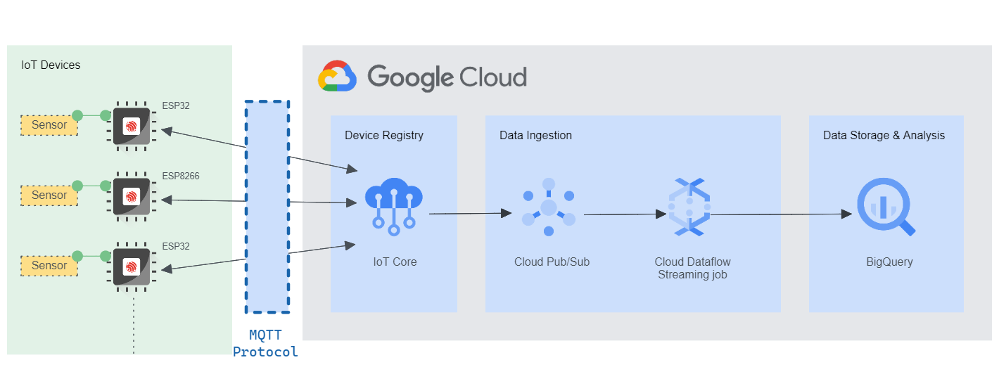

# (deprecated) esp32-gcp-iot-core

## NOTICE
> **Google Cloud IoT Core has been officially retired on August 16, 2023.** No device can be connected to Google Cloud IoT Core MQTT as well as HTTP bridges. All connections are going to shut down beyond that date.

## CONTENTS
- [Hardware Compatibility](#hardware-compatibility)
- [Libraries](#libraries)
- [High Level Architecture Diagram](#high-level-architecture-diagram)

---
### Hardware Compatibility
The project can show how you can use this firmware with various Arduino compatible hardware:
- ESP32 Dev Kit V1 Development Board
- ESP8266 Development Board

### Libraries
- [WiFiManager](https://github.com/tzapu/WiFiManager)
- [google-cloud-iot-arduino](https://github.com/GoogleCloudPlatform/google-cloud-iot-arduino)
- [arduino-mqtt](https://github.com/256dpi/arduino-mqtt)
- [ArduinoJson](https://github.com/bblanchon/ArduinoJson)

### High Level Architecture

> This project demonstrates the workflow from IoT devices to Device Registry only. Data Ingestion, Storage, and Analysis workflows are developed and deployed separately.